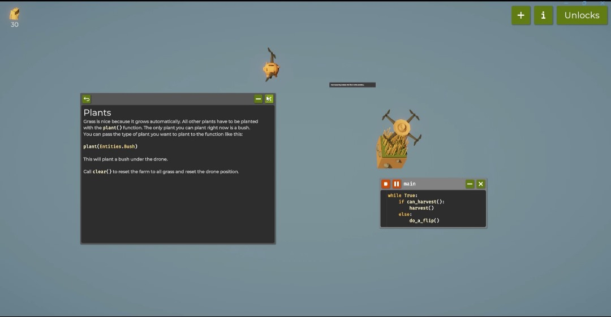
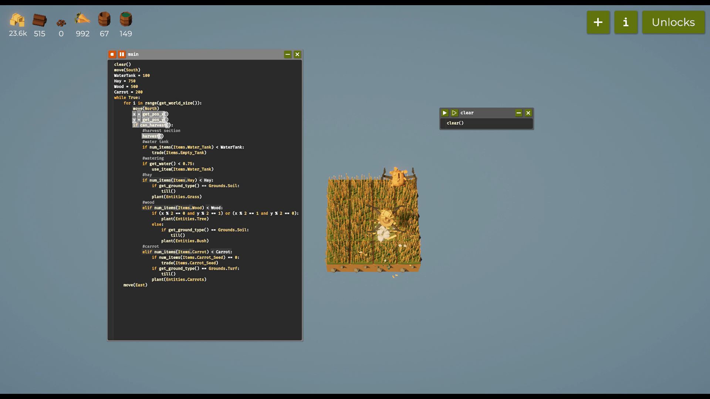
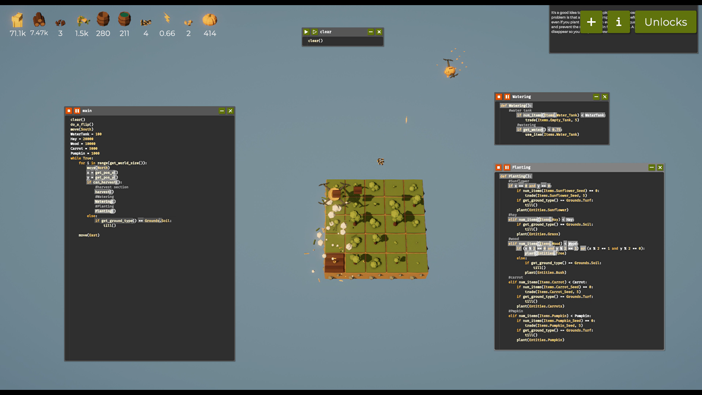

# Programming the Framing Drone(Report)

## Introduction
The Farmer Was Replaced is a programming and automation game where players control a drone on a virtual farm using Python code.
The goal is to automate farming tasks such as planting, watering, fertilizing, and harvesting crops, each with unique rules and growth patterns. 
Players write scripts to manage these tasks efficiently, gradually tackling more complex challenges like solving mazes, optimizing growth patterns for high yields, and sorting items. 
Through this, the game teaches programming logic and algorithms in a practical, interactive setting

# Table od Contents
-[Code Snippets and Explanation](#code-snippets-and-explanation)
-[Challenges and Learnings](#challenges-and-learnings)
-[references](#references)

# Code-Snippets-and_Explanation
## Step 1:Farming on 1 tile
**Code:**

```Python
while True:
    if can_harvest():
        harvest()
    else:
        do_a_flip()
```
**Explanation:**
The code runs an infinite number of times and harvest the grass with the if condition.
And once the drone harvest hay,it will do a flip.
**Demo:**


**Notes**
    -  By using the adove code, I was able to harvest enough hay needed to expand the tiles.
    -  I was also able to unlock variables and functions too.

## Step 2:Farming on 3x3 tile

**Code:**

```Python
while True:
    for i in range(get_world_size()):
        move(north)
        if can_harvest():
            harvest()
            if num_items(Items.hay) < 500:
                plant(Entities.Grass)
            else:
                plant(Entities.Bush)
    move(East)
```
**Explanation:**
This code continuously moves the drone north across the world, 
harvesting crops and planting new ones based on the amount of hay collected. 
If the drone has less than 500 hay items, it plants grass; otherwise, it plants bushes. 
After completing the northward movement, the drone moves east to start the next row.

**Demo:**

**Notes**

## Step 3:Farming on 4x4 tile
**Code:**
```Python
clear()
move(South)
WaterTank = 100
Hay = 750
Wood = 500
Carrot = 200
while True:
    for i in range(get_world_size()):
        move(North)
        x = get_pos_x()
        y = get_pos_y()
        if can_harvest():
            # harvest section
            harvest()
            # water tank
            if num_items(Items.Water_Tank) < WaterTank:
                trade(Items.Empty_Tank)
            # watering
            if get_water() < 0.75:
                use_item(Items.Water_Tank)
            # hay
            if num_items(Items.Hay) < Hay:
                if get_ground_type() == Grounds.Soil:
                    till()
                plant(Entities.Grass)
            # wood
            elif num_items(Items.Wood) < Wood:
                if (x % 2 == 0 and y % 2 == 1) or (x % 2 == 1 and y % 2 == 0):
                    plant(Entities.Tree)
                else:
                    if get_ground_type() == Grounds.Soil:
                        till()
                    plant(Entities.Bush)
            # carrot
            elif num_items(Items.Carrot) < Carrot:
                if num_items(Items.Carrot_Seed) == 0:
                    trade(Items.Carrot_Seed)
                if get_ground_type() == Grounds.Turf:
                    till()
                plant(Entities.Carrots)
    move(East)
```
**Explanation:**
This code continuously moves the drone north across the world, harvesting crops and managing resources based on predefined thresholds.
Harvesting: The drone checks if it can harvest from the current tile and collects resources.
Water Management: If the number of water tanks is below the specified threshold, the drone trades for an empty water tank. If the water level is below 75%, it uses the water tank to water the crops.
Planting Logic:
If the number of hay items is below 750, the drone tills the ground (if it's soil) and plants grass.
If the number of wood items is below 500, it plants trees or bushes based on its current position.
If the number of carrots is below 200, it trades for carrot seeds if none are available, tills the ground (if it's turf), and plants carrots.
After completing the northward movement across all tiles, the drone moves east to start the next column.
**Demo:**


## Step 4:Farming on 5x5 tile
**Code:**
```python
# main
def main():
    clear()
    do_a_flip()
    move(South)
    WaterTank = 100
    Hay = 20000
    Wood = 10000
    Carrot = 5000
    Pumpkin = 1000

    while True:
        for i in range(get_world_size()):
            move(North)
            x = get_pos_x()
            y = get_pos_y()

            if can_harvest():
                # Harvest section
                harvest()
                # Watering
                Watering()
                # Planting
                Planting()

            else:
                if get_ground_type() == Grounds.Soil:
                    till()

            move(East)

# planting
def Planting():
    # Sunflower
    if x == 0 and y == 0:
        if num_items(Items.Sunflower_Seed) == 0:
            trade(Items.Sunflower_Seed, 5)
        if get_ground_type() == Grounds.Turf:
            till()
        plant(Entities.Sunflower)

    # Hay
    elif num_items(Items.Hay) < Hay:
        if get_ground_type() == Grounds.Soil:
            till()
        plant(Entities.Grass)

    # Wood
    elif num_items(Items.Wood) < Wood:
        if (x % 2 == 0 and y % 2 == 0) or (x % 2 == 1 and y % 2 == 0):
            plant(Entities.Tree)
        else:
            if get_ground_type() == Grounds.Soil:
                till()
            plant(Entities.Bush)

    # Carrot
    elif num_items(Items.Carrot) < Carrot:
        if num_items(Items.Carrot_Seed) == 0:
            trade(Items.Carrot_Seed, 5)
        if get_ground_type() == Grounds.Turf:
            till()
        plant(Entities.Carrots)

    # Pumpkin
    elif num_items(Items.Pumpkin) < Pumpkin:
        if num_items(Items.Pumpkin_Seed) == 0:
            trade(Items.Pumpkin_Seed, 5)
        if get_ground_type() == Grounds.Turf:
            till()
        plant(Entities.Pumpkin)

# watering
def Watering():
    # Water tank
    if num_items(Items.Water_Tank) < WaterTank:
        trade(Items.Empty_Tank, 5)

    # Watering
    if get_water() < 0.75:
        use_item(Items.Water_Tank)
```
***Eaplanation:**

 The main() function starts by clearing the state, performing a flip, and moving the drone south. It initializes thresholds for various resources: water tanks, hay, wood, carrots, and pumpkins.

Main Loop: The drone enters an infinite loop where it moves north across the world. For each tile:

Harvesting: If the drone can harvest, it calls the harvest() function, followed by the Watering() and Planting() functions to manage resources and plant new crops.
Tilling: If the drone cannot harvest and the ground type is soil, it tills the ground.
Movement: After processing each tile, the drone moves east to start the next column.

Planting Functionality
The Planting() function handles the planting logic based on the current position and inventory:

Sunflower: If no sunflower seeds are available, it trades for 5 seeds and plants a sunflower.
Hay: If the number of hay items is below 20,000, it tills the ground (if soil) and plants grass.
Wood: If the number of wood items is below 10,000, it plants trees or bushes based on the drone's position.
Carrot: If the number of carrots is below 5,000, it trades for carrot seeds if none are available, tills the ground (if turf), and plants carrots.
Pumpkin: If the number of pumpkins is below 1,000, it trades for pumpkin seeds if none are available, tills the ground (if turf), and plants pumpkins.
Watering Functionality
The Watering() function manages the water resources:

If the number of water tanks is below 100, it trades for 5 empty water tanks.
If the water level is below 75%, it uses the water tank to water the crops.

**Demo:**


## Step 5:Farming on 8x8 tile

**Code:**

```python
# main

# planting
def Planting():
    #Sunflower
    if num_items(Items.Power) < Power:
        if get_ground_type() == Grounds.Turf:
            till()
            plant(Entities.Sunflower)
    #hay
    elif num_items(Items.Hay) < Hay:
        if get_ground_type() == Grounds.Soil:
            till()
            plant(Entities.Grass)
    #wood
    elif num_items(Items.Wood) < Wood:
        if (x % 2 == 0 and y % 2 == 1) or (x % 2 == 1 and y % 2 == 0):
            plant(Entities.Tree)
        else:
            if get_ground_type() == Grounds.Soil:
                till()
                plant(Entities.Bush)
    #carrot
    elif num_items(Items.Carrot) < Carrot:
        if get_ground_type() == Grounds.Turf:
            till()
            plant(Entities.Carrots)
    #Papkin
    elif num_items(Items.Pumpkin) < Pumpkin:
        if get_ground_type() == Grounds.Turf:
            till()
            plant(Entities.Pumpkin)
```
# Challenges and Learnings

## Challenges
During my gameplay, I faced several challenges, including:
Movement Optimization: Initially, the drone would take longer routes to harvest, leading to inefficiencies. I had to strategize the movement patterns to minimize travel time.
Resource Management: Keeping track of harvested resources and ensuring I had enough for future upgrades was challenging.
I implemented optimization methods such as:

Pathfinding Algorithms: I researched and applied basic pathfinding techniques to improve the drone's navigation.
Batch Processing: Harvesting multiple tiles in one go instead of one at a time improved efficiency.

## Learnings
Throughout this project, I learned various programming concepts, including:

Loop Structures: I gained a deeper understanding of while loops and their applications in automation.
Functions: Creating reusable functions allowed me to streamline my code and reduce redundancy.
Algorithm Design: I learned how to design algorithms that efficiently direct the drone's actions based on its current position and available resources.

## References
https://youtu.be/gmJ357XAAdE
https://www.youtube.com/watch?v=3Gk84cwjGzY&list=PPSV